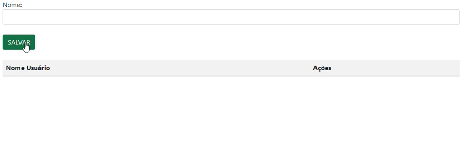

## Projeto de Login HTML/CSS

    Este projeto consiste em um formulário de login e validação de cpf simples implementado usando HTML e CSS. O objetivo é criar uma interface amigável e visualmente atraente para que os usuários possam se conectar a um sistema ou aplicativo.

## Indice

[funcionalidades](#funcionalidades)
[variaveis](#variáveis)
[funcoes](#funções)
[tecnologias_utilizadas](#tecnologias-utilizadas)
[imagens_demonstrativas](#imagens-demonstrativos)
[autor](#autor)

## Funcionalidades:

    Campo de entrada para o email do usuário.
    Campo de entrada para a senha do usuário.
    Botão "ACESSAR" para submeter o formulário (funcionalidade de login não implementada nesta versão).

## Variáveis:

### dadosLista:

    Um array (lista) que armazena os nomes dos usuários cadastrados. Cada nome é adicionado a este array quando o usuário clica no botão "Salvar".

### nomeUser: 

    Uma variável que armazena o nome digitado pelo usuário no campo de entrada.

### tabela:

    Uma variável que armazena uma referência ao elemento HTML da tabela onde os nomes dos usuários serão exibidos.

### i: 

    Um contador utilizado nos loops for para iterar sobre os elementos do array dadosLista e
    construir a tabela.

## Funções:

### acessar():
#### Objetivo: 

    Simula a ação de login, redirecionando para a página de cadastro (por enquanto).

#### Funcionamento:

    Obtém os valores dos campos de email e senha.
    Verifica se ambos os campos foram preenchidos.
    Se os campos estiverem preenchidos, redireciona para a página de cadastro. Caso contrário, exibe um alerta.

### salvarUser():
#### Objetivo:

    Adiciona um novo nome de usuário à lista e atualiza a tabela.

#### Funcionamento:

    Obtém o nome digitado pelo usuário.
    Verifica se o campo de nome está preenchido.
    Adiciona o nome ao array dadosLista.
    Atualiza a tabela HTML para exibir o novo nome.

### criarLista():
#### Objetivo: 

    Cria a tabela HTML com os nomes dos usuários cadastrados.

#### Funcionamento:

    Limpa o conteúdo da tabela.
    Cria o cabeçalho da tabela (colunas "Nome Usuário" e "Ações").
    Itera sobre o array dadosLista e cria uma linha na tabela para cada nome.
    Adiciona botões de "Editar" e "Excluir" para cada linha.

### excluir(i):
#### Objetivo: 

    Remove um nome da lista e da tabela.

#### Funcionamento:

    Remove o elemento na posição i do array dadosLista.
    Remove a linha na posição i da tabela.

### editar(i):
#### Objetivo:

    Permite editar um nome existente na lista.

#### Funcionamento:

    Obtém o nome da posição i do array dadosLista e coloca-o no campo de entrada.
    emove o elemento na posição i do array dadosLista.
    
## Tecnologias Utilizadas:

    HTML: Para estruturar o conteúdo da página e definir os elementos do formulário.
    CSS: Para estilizar o layout, cores, fontes e outros aspectos visuais do formulário.    

# Imagens Demonstrativos:

## Autor
|  [ Luan Alencar](https://github.com/luan18alencar) |  
| :---: |

